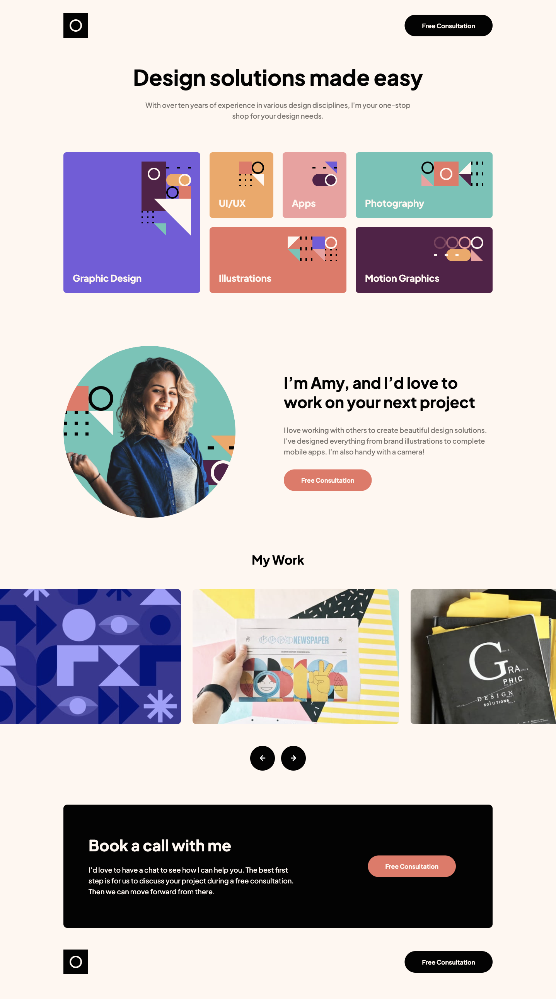

# Frontend Mentor - Single-page design portfolio solution

This is a solution to the [Single-page design portfolio challenge on Frontend Mentor](https://www.frontendmentor.io/challenges/singlepage-design-portfolio-2MMhyhfKVo).

## Table of contents

- [Overview](#overview)
  - [The challenge](#the-challenge)
  - [Screenshot](#screenshot)
  - [Links](#links)
- [My process](#my-process)
  - [Built with](#built-with)
  - [What I learned](#what-i-learned)

## Overview

The main objective of the project was to develop a single-page portfolio landing page with a simple structure.

### The challenge

This project aimed to assess and showcase my layout skills, with a focus on creating a fully responsive website using CSS Grid. Additionally, the project required basic JavaScript skills to implement an image carousel.

Users should be able to:

- View the optimal layout for the site depending on their device's screen size
- See hover states for all interactive elements on the page
- Navigate the slider using either their mouse

### Screenshot

### Links

- Solution URL: [Add solution URL here](https://www.frontendmentor.io/challenges/singlepage-design-portfolio-2MMhyhfKVo/hub)
- Live Site URL: [Add live site URL here](https://dee-diaz.github.io/single-page-design-portfolio/)

## My process
1. Set up a basic HTML file with the necessary structure.

2. Successfully set up and configured Gulp in order to compile my SASS code into CSS and assist me with various tasks throughout the development process.

3. Wrote the CSS styles using SASS, which is a CSS preprocessor that makes it easier to write complex stylesheets. SASS allows you to use variables, mixins, and functions, which can simplify the process of writing CSS.

4. Used BEM methodology to structure the CSS. BEM stands for Block Element Modifier and is a naming convention for CSS classes that makes it easier to manage and scale large CSS projects. BEM encourages the use of modular, reusable code and helps to avoid specificity issues.

5. Utilized both CSS Grid and Flexbox to create a layout.

6. Developed an image slider using pure JavaScript, without relying on any additional libraries or frameworks.

7. Tested the landing page to make sure it displays correctly in different browsers and devices.

### Built with

- Semantic HTML5 markup
- SASS
- Flexbox
- CSS Grid
- JavaScript
- Gulp
- BEM

### What I learned
During the development of this project, I gained some experience with CSS Grid and utilized my limited JavaScript knowledge to create a slider. Although the slider does not function as desired and lacks optimization for different screen sizes, it represents my best effort. I acknowledge that there is significant room for improvement in this aspect.
